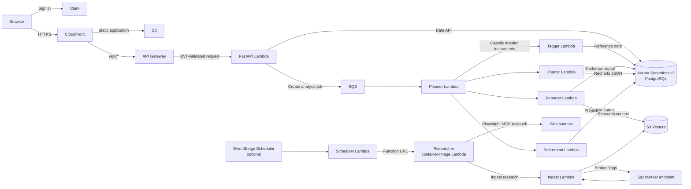

# Alex | Multi-Agent Portfolio Intelligence Platform

Alex is an event-driven portfolio intelligence application deployed end to end on AWS. Authenticated users manage accounts and holdings, trigger asynchronous portfolio analysis, and retrieve persistent reports, visualizations, and retirement projections.

The system combines a Next.js client with a serverless Python backend, an Aurora PostgreSQL data model, a vector-backed research knowledge base, and specialized AI agents coordinated through SQS.

## Architecture



## System Behavior

1. A signed-in user submits an analysis request through the API.
2. The API creates a job in Aurora and sends its ID to SQS.
3. The Planner consumes the message, enriches missing instrument data when necessary, refreshes market data, and coordinates the specialist agents.
4. Reporter, Charter, and Retirement persist their outputs in separate job payloads. The client polls job status and renders the completed result.
5. Independently, the optional scheduled Researcher gathers market context through a Playwright MCP server and adds embedded documents to the S3 Vectors knowledge base.

## Engineering Highlights

- **Asynchronous orchestration:** SQS decouples request handling from long-running agent execution; a dead-letter queue retains messages that exhaust retry attempts.
- **Specialized workloads:** the Planner delegates enrichment, narrative reporting, chart generation, and retirement projections to independently deployable Lambda functions.
- **Durable, isolated outputs:** agents write to dedicated Aurora JSONB job fields rather than requiring a shared in-memory result merger.
- **AI integration:** OpenAI Agents SDK runs against Amazon Bedrock; the Tagger uses structured outputs, while tool-oriented agents use purpose-built data and retrieval tools.
- **Knowledge retrieval:** financial research is embedded by SageMaker and indexed in S3 Vectors for semantic retrieval.
- **Infrastructure as code:** Terraform components retain independent local state, allowing individual services to be deployed and destroyed independently.
- **Operational visibility:** CloudWatch logs cover Lambda execution; LangFuse tracing is supported when its optional environment variables are configured.

## Technology Stack

| Area | Technologies |
| --- | --- |
| Application | Python 3.12, FastAPI, Pydantic, OpenAI Agents SDK |
| AI and retrieval | Amazon Bedrock, SageMaker, S3 Vectors, Playwright MCP |
| Compute and integration | AWS Lambda, API Gateway, SQS, EventBridge, ECR |
| Data | Aurora Serverless v2 PostgreSQL, RDS Data API, Secrets Manager |
| Frontend | Next.js, React, TypeScript, Clerk, Recharts |
| Delivery and observability | Terraform, Docker, CloudFront, CloudWatch, LangFuse |

## Run Locally

### Prerequisites

- Node.js 20+ and npm
- [uv](https://docs.astral.sh/uv/)
- Docker Desktop
- Terraform 1.5+
- AWS CLI configured with credentials that can access the provisioned development resources

### Configuration

Create a root `.env` from [`.env.example`](.env.example) and configure the backend and AWS integration values. Create `frontend/.env.local` with the Clerk keys and the local API URL. Do not commit either file.

### Start the application

```bash
cd scripts
uv run run_local.py
```

The runner starts the FastAPI service at `http://localhost:8000` and the Next.js application at `http://localhost:3000`. Interactive API documentation is available at `http://localhost:8000/docs`.

### Run tests

Use mocked local tests before testing deployed resources:

```bash
cd backend
uv run test_simple.py
```

After AWS resources are configured, exercise the deployed flow:

```bash
cd backend
uv run test_full.py
```

Individual agents also provide `test_simple.py` and `test_full.py` within their respective directories.

## Deploy to AWS

Terraform is intentionally split into independent components. Each component maintains its own local state and requires a `terraform.tfvars` file created from its corresponding example before it is applied.

Deploy the components in dependency order:

1. `terraform/2_sagemaker`
2. `terraform/3_ingestion`
3. `terraform/4_researcher`
4. `terraform/5_database`
5. `terraform/6_agents`
6. `terraform/7_frontend`
7. `terraform/8_enterprise`

Package and update the agent Lambdas with Docker before applying the agent infrastructure:

```bash
cd backend
uv run package_docker.py
uv run deploy_all_lambdas.py
```

Build and deploy the API/frontend infrastructure and static site:

```bash
cd scripts
uv run deploy.py
```

The deployment scripts check for Docker, Terraform, npm, and AWS CLI availability. Review Terraform plans and AWS costs before applying changes. Destroy unused components when development pauses, especially the database tier.

## Security and Operating Boundaries

- Clerk JWTs are validated by the API Lambda before application data is accessed.
- Database credentials are stored in AWS Secrets Manager; Lambda permissions are defined through IAM policies.
- Pydantic validation and agent output validation are used to constrain application inputs and generated data.
- CloudWatch logs support failure investigation, and optional LangFuse tracing records agent execution details.
- The current Researcher Function URL is public in Terraform. Restrict or authenticate it before exposing the system to untrusted traffic.
- Alex is for informational purposes only and does not provide financial, investment, or trading advice.

## Repository Layout

```text
backend/      Lambda functions, agents, API, ingestion, and shared database code
frontend/     Next.js application and Clerk integration
terraform/    Independently managed AWS infrastructure components
scripts/      Local development and frontend deployment entry points
guides/       Architecture and operating reference material
```

## License

Distributed under the [MIT License](LICENSE).
